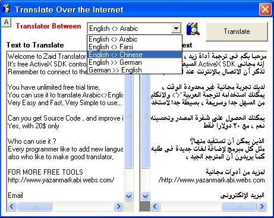



## ZaidTrans 2\.0 \- Google Translator \- Update

### Description

ZaidTrans is free tool, let you to Translate any text via the internet, very Easy and Fast, with unlimited free trial time.

English-Arabic-Farsi-German-Chinese
 
### More Info
 

             |
---                |---
**Submitted On**   |2009-07-10 21:43:30
**By**             |[Zaid Markabi](https://github.com/Planet-Source-Code/PSCIndex/blob/master/ByAuthor/zaid-markabi.md)
**Level**          |Beginner
**User Rating**    |4.3 (26 globes from 6 users)
**Compatibility**  |VB 5\.0, VB 6\.0
**Category**       |[Internet/ HTML](https://github.com/Planet-Source-Code/PSCIndex/blob/master/ByCategory/internet-html__1-34.md)
**World**          |[Visual Basic](https://github.com/Planet-Source-Code/PSCIndex/blob/master/ByWorld/visual-basic.md)
**Archive File**   |[ZaidTrans\_2158847302009\.zip](https://github.com/Planet-Source-Code/zaid-markabi-zaidtrans-2-0-google-translator-update__1-72324/archive/master.zip)

